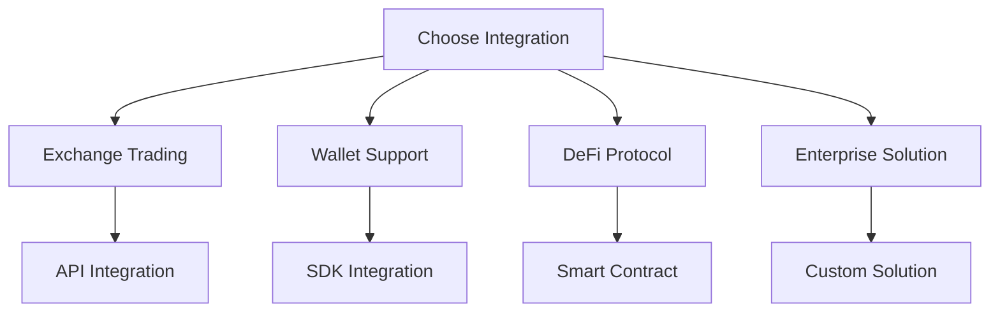

# TOS Network Ecosystem Integration Hub

Connect your project with the growing TOS Network ecosystem through our comprehensive integration guides and partner APIs.

## 🌐 Integration Categories

### 💱 **Exchange Integrations**
Connect with major cryptocurrency exchanges
- [**Binance Integration**](/ecosystem/exchanges#binance) - Spot and futures trading
- [**Coinbase Integration**](/ecosystem/exchanges#coinbase) - Retail and institutional
- [**KuCoin Integration**](/ecosystem/exchanges#kucoin) - Advanced trading features
- [**Gate.io Integration**](/ecosystem/exchanges#gateio) - Global market access
- [**DEX Aggregators**](/ecosystem/exchanges#dex-aggregators) - Multi-DEX routing

### 👛 **Wallet Integrations**
Support popular crypto wallets
- [**MetaMask Integration**](/ecosystem/wallets#metamask) - Browser extension support
- [**WalletConnect Integration**](/ecosystem/wallets#walletconnect) - Mobile wallet protocol
- [**Trust Wallet Integration**](/ecosystem/wallets#trust-wallet) - Mobile-first wallet
- [**Ledger Integration**](/ecosystem/wallets#ledger) - Hardware wallet support
- [**Custom Wallet SDK**](/ecosystem/wallets#custom-sdk) - Build your own wallet

### 🌉 **Cross-Chain Bridges**
Multi-chain connectivity solutions
- [**Ethereum Bridge**](/ecosystem/bridges#ethereum) - ETH ↔ TOS transfers
- [**BSC Bridge**](/ecosystem/bridges#bsc) - Binance Smart Chain integration
- [**Polygon Bridge**](/ecosystem/bridges#polygon) - Layer 2 scaling
- [**Avalanche Bridge**](/ecosystem/bridges#avalanche) - High-speed transfers
- [**Custom Bridge SDK**](/ecosystem/bridges#sdk) - Build custom bridges

### 🏦 **DeFi Protocol Integrations**
Decentralized finance ecosystem
- [**TOSSwap Integration**](/ecosystem/defi-protocols#tosswap) - Native DEX
- [**Uniswap V3 Integration**](/ecosystem/defi-protocols#uniswap) - Automated market making
- [**Aave Integration**](/ecosystem/defi-protocols#aave) - Lending and borrowing
- [**Compound Integration**](/ecosystem/defi-protocols#compound) - Interest rate protocols
- [**1inch Integration**](/ecosystem/defi-protocols#1inch) - DEX aggregation

### 🏢 **Enterprise Solutions**
Business and institutional integrations
- [**Custody Solutions**](/ecosystem/enterprise#custody) - Institutional-grade security
- [**Payment Processors**](/ecosystem/enterprise#payments) - Merchant integration
- [**Banking APIs**](/ecosystem/enterprise#banking) - Traditional finance bridge
- [**Compliance Tools**](/ecosystem/enterprise#compliance) - Regulatory compliance
- [**White-label Solutions**](/ecosystem/enterprise#white-label) - Custom branding

### 📱 **Mobile SDK Integration**
Mobile application development
- [**iOS SDK**](/ecosystem/mobile-sdks#ios) - Native iOS integration
- [**Android SDK**](/ecosystem/mobile-sdks#android) - Native Android integration
- [**React Native SDK**](/ecosystem/mobile-sdks#react-native) - Cross-platform solution
- [**Flutter SDK**](/ecosystem/mobile-sdks#flutter) - Google's UI toolkit
- [**Unity SDK**](/ecosystem/mobile-sdks#unity) - Game development

### 🔗 **API Partner Integration**
Third-party service providers
- [**Price Data Providers**](/ecosystem/api-partners#price-data) - Real-time pricing
- [**Analytics Platforms**](/ecosystem/api-partners#analytics) - Blockchain analytics
- [**Node Providers**](/ecosystem/api-partners#nodes) - Infrastructure services
- [**Oracle Networks**](/ecosystem/api-partners#oracles) - External data feeds
- [**Security Auditors**](/ecosystem/api-partners#security) - Smart contract auditing

## 🚀 Quick Start Guide

### 1. Choose Your Integration Type



### 2. Get API Credentials

Most integrations require API credentials:

```javascript
// Example configuration
const config = {
  // TOS Network connection
  rpcUrl: 'https://rpc.tos.network',
  networkId: 1,

  // Partner API credentials
  apiKey: 'your_partner_api_key',
  secretKey: 'your_partner_secret',

  // Integration settings
  testMode: true,
  webhookUrl: 'https://your-app.com/webhook'
};
```

### 3. Install Required SDKs

```bash
# Core TOS Network SDK
npm install @tos-network/sdk

# Partner-specific SDKs (choose as needed)
npm install @tos-network/exchange-sdk
npm install @tos-network/wallet-sdk
npm install @tos-network/bridge-sdk
npm install @tos-network/defi-sdk
```

### 4. Basic Integration Example

```javascript
import { TOSNetworkSDK } from '@tos-network/sdk';
import { ExchangeIntegration } from '@tos-network/exchange-sdk';

// Initialize TOS Network connection
const tos = new TOSNetworkSDK({
  rpcUrl: 'https://rpc.tos.network',
  privateKey: process.env.PRIVATE_KEY
});

// Initialize exchange integration
const exchange = new ExchangeIntegration({
  exchange: 'binance',
  apiKey: process.env.BINANCE_API_KEY,
  secret: process.env.BINANCE_SECRET,
  testnet: true
});

// Example: Get TOS price and execute trade
async function tradeTOS() {
  const price = await exchange.getPrice('TOS/USDT');
  console.log(`Current TOS price: $${price}`);

  // Place a buy order
  const order = await exchange.createOrder({
    symbol: 'TOS/USDT',
    side: 'buy',
    amount: 100,
    price: price * 0.99 // 1% below market
  });

  console.log('Order placed:', order);
}
```

## 🛠️ Integration Tools

### Development Environment

```bash
# TOS Network development tools
npm install -g @tos-network/cli

# Initialize new integration project
tos-cli init my-integration --type=exchange
cd my-integration

# Install dependencies
npm install

# Start development server
npm run dev
```

### Testing Framework

```javascript
// test/integration.test.js
import { TOSTestFramework } from '@tos-network/testing';

describe('Exchange Integration', () => {
  let testFramework;

  beforeEach(async () => {
    testFramework = new TOSTestFramework({
      network: 'testnet',
      integration: 'binance'
    });

    await testFramework.setup();
  });

  it('should connect to exchange', async () => {
    const connection = await testFramework.testConnection();
    expect(connection.success).toBe(true);
  });

  it('should fetch TOS price', async () => {
    const price = await testFramework.getPrice('TOS/USDT');
    expect(price).toBeGreaterThan(0);
  });
});
```

### Monitoring and Analytics

```javascript
// monitoring/dashboard.js
import { IntegrationMonitor } from '@tos-network/monitoring';

const monitor = new IntegrationMonitor({
  integrations: ['binance', 'metamask', 'uniswap'],
  alerts: {
    email: 'admin@yourapp.com',
    webhook: 'https://your-app.com/alerts'
  }
});

// Monitor integration health
monitor.track('api_calls', { integration: 'binance', endpoint: 'getPrice' });
monitor.track('errors', { integration: 'metamask', error: 'connection_failed' });

// Generate performance reports
const report = await monitor.generateReport('daily');
console.log(report);
```

## 📋 Integration Checklist

### Pre-Integration
- [ ] Review partner documentation
- [ ] Obtain necessary API credentials
- [ ] Set up development environment
- [ ] Plan integration architecture
- [ ] Define testing strategy

### Development Phase
- [ ] Implement core integration logic
- [ ] Add error handling and retries
- [ ] Implement authentication/authorization
- [ ] Add logging and monitoring
- [ ] Write comprehensive tests

### Testing Phase
- [ ] Unit tests for all functions
- [ ] Integration tests with partner APIs
- [ ] Load testing for high-volume scenarios
- [ ] Security testing and penetration testing
- [ ] User acceptance testing

### Production Deployment
- [ ] Configure production environment
- [ ] Set up monitoring and alerting
- [ ] Implement rate limiting and circuit breakers
- [ ] Deploy with zero downtime strategy
- [ ] Monitor initial rollout

### Post-Deployment
- [ ] Monitor performance metrics
- [ ] Track integration health
- [ ] Optimize based on usage patterns
- [ ] Regular security audits
- [ ] Partner relationship management

## 🤝 Partner Program

### Become a TOS Network Partner

Join our growing ecosystem of integration partners:

1. **Apply for Partnership**
   - Submit integration proposal
   - Technical review process
   - Partnership agreement

2. **Technical Integration**
   - Access to partner APIs
   - Technical support team
   - Integration testing environment

3. **Go-to-Market Support**
   - Joint marketing opportunities
   - Co-branded materials
   - Event participation

4. **Ongoing Partnership**
   - Regular technical reviews
   - Feature collaboration
   - Revenue sharing opportunities

### Partner Benefits

- **Technical Support**: Dedicated integration support team
- **Marketing Support**: Joint promotional opportunities
- **Priority Access**: Early access to new features and APIs
- **Revenue Sharing**: Earn from successful integrations
- **Ecosystem Growth**: Be part of the growing TOS Network

## 📊 Integration Success Metrics

### Key Performance Indicators (KPIs)

```javascript
// Example metrics tracking
const metrics = {
  // Volume metrics
  daily_volume: '1,250,000 TOS',
  monthly_volume: '35,750,000 TOS',

  // User metrics
  active_users: 15420,
  new_users: 1250,
  retention_rate: '78.5%',

  // Technical metrics
  api_uptime: '99.9%',
  response_time: '45ms',
  error_rate: '0.1%',

  // Business metrics
  revenue_generated: '$125,000',
  partner_satisfaction: '9.2/10',
  integration_completion_rate: '94%'
};
```

### Success Stories

**Binance Integration**
- Integrated TOS trading in 2 weeks
- 500K+ TOS daily volume
- 99.9% uptime since launch

**MetaMask Integration**
- 100K+ wallet connections
- Seamless user experience
- High user satisfaction scores

**Uniswap Integration**
- Deep liquidity pools
- Efficient price discovery
- Strong DeFi ecosystem growth

## 🆘 Support and Resources

### Technical Support
- **Discord**: [#integration-support](https://discord.gg/tos-integrations)
- **Email**: integrations@tos.network
- **GitHub**: [Integration Examples](https://github.com/tos-network/integrations)
- **Documentation**: [docs.tos.network/ecosystem](https://docs.tos.network/ecosystem)

### Partner Resources
- **Partner Portal**: Access exclusive resources and tools
- **Technical Documentation**: Comprehensive API documentation
- **Sample Code**: Ready-to-use integration examples
- **Best Practices**: Proven integration patterns

### Community
- **Developer Forum**: Community-driven support
- **Monthly Calls**: Technical discussion sessions
- **Hackathons**: Build and showcase integrations
- **Conferences**: Network with other partners

---

**Ready to integrate?** Choose your integration type above and start building with TOS Network's comprehensive ecosystem!

**"Don't Trust, Verify it"** - All integrations are built with transparency and verifiability at their core!