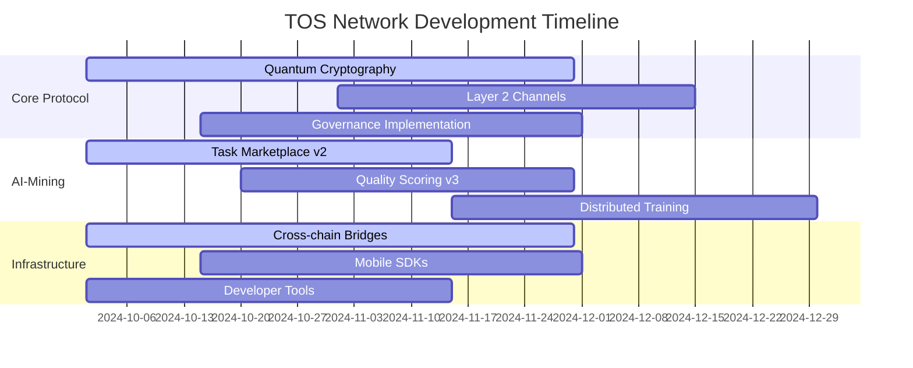
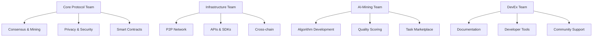
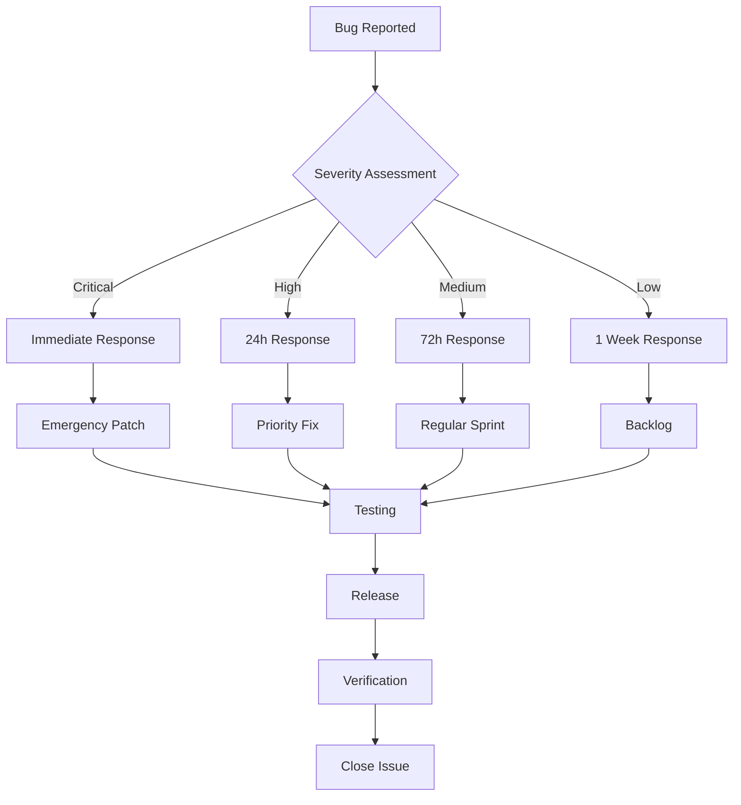

# TOS Network Development Status

Track the real-time progress of TOS Network development, including active features, upcoming releases, and community contributions.

## 🚀 Current Development Sprint

**Sprint**: v3.2 "Quantum Preparation"
**Duration**: October 1 - November 15, 2024
**Progress**: 67% Complete

### Active Development Areas



## 📊 Feature Implementation Status

### ✅ Completed Features (v3.1)

| Feature | Status | Release Date | Adoption Rate |
|---------|--------|--------------|---------------|
| **Enhanced AI-Mining** | ✅ Complete | March 2024 | 89.2% |
| **Ring Signatures** | ✅ Complete | March 2024 | 76.5% |
| **Cross-chain Bridges** | ✅ Complete | March 2024 | 34.7% |
| **Smart Contract Gas Optimization** | ✅ Complete | March 2024 | 95.1% |
| **Dynamic Transaction Fees** | ✅ Complete | March 2024 | 98.8% |

### 🔄 In Development (v3.2)

| Feature | Progress | Lead Dev | Target Date | Priority |
|---------|----------|----------|-------------|----------|
| **Post-Quantum Cryptography** | 67% | @quantum-team | Nov 2024 | 🔴 High |
| **Layer 2 Payment Channels** | 45% | @l2-team | Dec 2024 | 🟡 Medium |
| **On-chain Governance** | 78% | @governance-team | Dec 2024 | 🔴 High |
| **AI Task Marketplace v2** | 89% | @ai-team | Nov 2024 | 🟠 High |
| **Avalanche Bridge** | 23% | @bridge-team | Jan 2025 | 🟡 Medium |

### 🔮 Planned Features (v4.0+)

| Feature | Research Phase | Estimated Start | Complexity |
|---------|----------------|-----------------|------------|
| **Sharding Implementation** | 82% | Q1 2025 | Very High |
| **Zero-Knowledge Proofs** | 65% | Q2 2025 | High |
| **Hybrid Consensus (PoW/PoS)** | 34% | Q3 2025 | Very High |
| **AI-Mining Decentralized Training** | 78% | Q1 2025 | High |
| **Quantum-Safe Smart Contracts** | 45% | Q2 2025 | Very High |

## 👥 Development Team Structure

### Core Development Teams



#### Team Composition

**Core Protocol Team** (8 developers)
- **Lead**: @core-lead
- **Focus**: Blockchain core, consensus, cryptography
- **Location**: Distributed globally
- **Languages**: Rust, C++, Go

**Infrastructure Team** (6 developers)
- **Lead**: @infra-lead
- **Focus**: APIs, SDKs, networking, bridges
- **Location**: Americas & Europe
- **Languages**: Rust, TypeScript, Python

**AI-Mining Team** (5 developers)
- **Lead**: @ai-lead
- **Focus**: AI algorithms, mining optimization
- **Location**: Asia-Pacific & Americas
- **Languages**: Python, Rust, CUDA

**Developer Experience Team** (4 developers)
- **Lead**: @devex-lead
- **Focus**: Documentation, tools, community
- **Location**: Global
- **Languages**: TypeScript, React, Multiple

## 📈 Development Metrics

### Commit Activity (Last 30 Days)

```javascript
const developmentMetrics = {
  totalCommits: 342,
  activeDevelopers: 23,
  linesOfCode: {
    added: 28420,
    removed: 12150,
    net: 16270
  },
  pullRequests: {
    opened: 87,
    merged: 74,
    closed: 81
  },
  issues: {
    opened: 156,
    resolved: 142,
    active: 89
  },
  testCoverage: {
    core: 94.2,
    infrastructure: 87.5,
    aiMining: 91.8,
    overall: 90.1
  }
};
```

### Performance Benchmarks

| Metric | Current | Target v3.2 | Improvement |
|--------|---------|-------------|-------------|
| **TPS** | 200 | 350 | +75% |
| **Block Time** | 15s | 10s | -33% |
| **AI Task Throughput** | 450/hr | 800/hr | +78% |
| **Cross-chain Latency** | 45s | 25s | -44% |
| **Gas Efficiency** | 1.0x | 1.4x | +40% |

### Code Quality Metrics

```rust
// Example code quality tracking
pub struct QualityMetrics {
    pub cyclomatic_complexity: f64,    // Target: < 10
    pub test_coverage: f64,            // Target: > 90%
    pub documentation_coverage: f64,   // Target: > 85%
    pub code_duplication: f64,         // Target: < 5%
    pub security_score: f64,           // Target: > 95%
}

impl QualityMetrics {
    pub fn current() -> Self {
        Self {
            cyclomatic_complexity: 7.2,
            test_coverage: 90.1,
            documentation_coverage: 88.4,
            code_duplication: 3.1,
            security_score: 96.8,
        }
    }
}
```

## 🔬 Research & Development

### Active Research Projects

**Quantum-Resistant Cryptography**
- **Status**: Algorithm selection phase
- **Lead Researcher**: @quantum-researcher
- **Timeline**: 6 months
- **Funding**: $250k research grant

```rust
// Post-quantum signature research
pub enum PQCCandidate {
    Dilithium3,    // NIST finalist
    Falcon512,     // NIST finalist
    SPHINCS256,    // Hash-based
    Picnic3,       // Zero-knowledge based
}

pub struct PQCEvaluation {
    pub signature_size: usize,
    pub verification_time: Duration,
    pub security_level: u8,
    pub quantum_resistance: bool,
}
```

**Sharding Architecture**
- **Status**: Theoretical design phase
- **Lead Researcher**: @sharding-researcher
- **Timeline**: 12 months
- **Complexity**: Very High

**AI-Mining Optimization**
- **Status**: Algorithm testing
- **Lead Researcher**: @ai-researcher
- **Timeline**: 4 months
- **Focus**: Distributed training protocols

### Research Publications

1. **"Quantum-Safe Blockchain: Post-Quantum Cryptography for TOS Network"**
   - Authors: TOS Research Team
   - Status: Under review
   - Journal: Quantum Information Processing

2. **"Efficient AI-Mining: Optimizing Distributed Machine Learning on Blockchain"**
   - Authors: AI-Mining Team
   - Status: Published
   - Conference: IEEE Blockchain 2024

3. **"BlockDAG Scalability: Performance Analysis of Directed Acyclic Graphs"**
   - Authors: Core Protocol Team
   - Status: In preparation
   - Target: ACM CCS 2025

## 🐛 Bug Tracking & Resolution

### Current Bug Statistics

| Severity | Open | In Progress | Resolved (30d) |
|----------|------|-------------|----------------|
| **Critical** | 0 | 1 | 3 |
| **High** | 2 | 4 | 12 |
| **Medium** | 15 | 8 | 34 |
| **Low** | 23 | 5 | 28 |
| **Enhancement** | 31 | 12 | 19 |

### Recent Critical Fixes

**Issue #1247: AI-Mining Memory Leak**
- **Severity**: Critical
- **Status**: ✅ Resolved
- **Fix Version**: v3.1.2
- **Resolution Time**: 18 hours

**Issue #1198: Cross-chain Bridge Timeout**
- **Severity**: High
- **Status**: ✅ Resolved
- **Fix Version**: v3.1.1
- **Resolution Time**: 3 days

**Issue #1156: Smart Contract Gas Estimation**
- **Severity**: High
- **Status**: ✅ Resolved
- **Fix Version**: v3.1.0
- **Resolution Time**: 5 days

### Bug Resolution Process



## 🚀 Release Management

### Release Cycle

**Major Releases**: Every 6 months
**Minor Releases**: Monthly
**Patch Releases**: As needed (security/critical bugs)

### Upcoming Releases

**v3.1.3** (Patch)
- **Target Date**: October 25, 2024
- **Focus**: Bug fixes and optimizations
- **Changes**: 12 bug fixes, 3 optimizations

**v3.2.0** (Minor)
- **Target Date**: December 15, 2024
- **Focus**: Quantum resistance and governance
- **Changes**: Major protocol upgrades

**v4.0.0** (Major)
- **Target Date**: June 2025
- **Focus**: Sharding and advanced consensus
- **Changes**: Breaking protocol changes

### Release Preparation Checklist

```yaml
release_checklist:
  code_freeze: "7 days before release"
  testing_phase:
    - unit_tests: "100% pass rate"
    - integration_tests: "100% pass rate"
    - security_audit: "No critical issues"
    - performance_tests: "Meet benchmarks"
  documentation:
    - release_notes: "Complete"
    - api_docs: "Updated"
    - migration_guide: "If needed"
  deployment:
    - testnet_deployment: "48h before mainnet"
    - monitoring_setup: "Real-time alerts"
    - rollback_plan: "Prepared"
```

## 🌍 Community Contributions

### Contributor Statistics

**Total Contributors**: 156
**Active Contributors (30d)**: 34
**First-time Contributors (30d)**: 8
**Core Team**: 23 developers

### Contribution Areas

| Area | Contributors | Commits (30d) |
|------|-------------|---------------|
| **Core Protocol** | 12 | 127 |
| **AI-Mining** | 8 | 89 |
| **Infrastructure** | 15 | 156 |
| **Documentation** | 22 | 78 |
| **Testing** | 18 | 92 |
| **Community Tools** | 31 | 145 |

### Top Contributors (All Time)

1. **@core-architect** - 2,847 commits
2. **@ai-pioneer** - 1,923 commits
3. **@bridge-builder** - 1,456 commits
4. **@crypto-expert** - 1,234 commits
5. **@community-champion** - 987 commits

### Recent Community Achievements

**October 2024**:
- 🎉 **Milestone**: 1000th community PR merged
- 🏆 **Achievement**: First community-led major feature (AI task optimizer)
- 📚 **Documentation**: 45 pages added by community
- 🐛 **Bug Fixes**: 23 community-reported bugs fixed

## 🔧 Development Tools & Infrastructure

### Build & CI/CD

```yaml
# GitHub Actions Workflow Status
workflows:
  build_and_test:
    status: "✅ Passing"
    runtime: "12 minutes"
    coverage: "90.1%"

  security_scan:
    status: "✅ Passing"
    last_scan: "2024-10-20"
    vulnerabilities: 0

  performance_benchmark:
    status: "✅ Passing"
    tps_achieved: 203
    memory_usage: "2.1GB"

  documentation_build:
    status: "✅ Passing"
    pages_built: 53
    search_indexed: true
```

### Development Environment

**Supported Platforms**:
- Linux (Ubuntu 20.04+, Debian 11+)
- macOS (11.0+)
- Windows (WSL2 recommended)

**Required Tools**:
```toml
[dependencies]
rust = "1.70+"
node = "18.0+"
python = "3.9+"
docker = "20.0+"
git = "2.30+"

[optional]
cuda = "11.8+"  # For AI-Mining development
```

### Code Standards

**Rust Code Style**:
```rust
// Example following TOS coding standards
#![deny(missing_docs)]
#![deny(unsafe_code)]

/// Documentation required for all public functions
pub fn calculate_mining_reward(
    block_height: u64,
    ai_mining_contribution: f64,
) -> Result<u64, MiningError> {
    // Implementation with proper error handling
    let base_reward = get_base_reward(block_height)?;
    let ai_bonus = (base_reward as f64 * ai_mining_contribution) as u64;

    Ok(base_reward + ai_bonus)
}
```

**Testing Requirements**:
- Unit test coverage: > 90%
- Integration test coverage: > 80%
- Documentation tests: Required for all public APIs
- Performance benchmarks: For critical paths

## 📞 Developer Communication

### Regular Meetings

**Core Dev Sync**: Every Tuesday, 2 PM UTC
- Attendance: Core development teams
- Format: Video call + recording
- Duration: 60 minutes

**Community Dev Call**: Every other Friday, 3 PM UTC
- Open to all contributors
- Demo new features and progress
- Q&A session

**Research Seminar**: Monthly, first Wednesday
- Technical deep dives
- Research presentations
- External expert talks

### Communication Channels

**Discord Channels**:
- `#core-development` - Core protocol discussion
- `#ai-mining-dev` - AI-Mining development
- `#infrastructure` - APIs, SDKs, tooling
- `#research` - Research and theoretical discussions

**GitHub Discussions**:
- Feature proposals and RFCs
- Technical design discussions
- Community feedback

**Developer Newsletter**:
- Monthly development updates
- Roadmap changes
- Technical tutorials

## 📊 Performance Monitoring

### Real-time Dashboards

```javascript
// Development metrics dashboard
const devMetrics = {
  buildSuccess: 97.8,      // % successful builds
  testCoverage: 90.1,      // % code coverage
  codeQuality: 8.7,        // Maintainability index
  deploymentFreq: 2.3,     // Deployments per week
  leadTime: 3.2,           // Days from commit to production
  mttr: 4.1,               // Mean time to recovery (hours)
  changeFailure: 2.1       // % failed deployments
};
```

### Performance Tracking

**Key Performance Indicators**:
- Feature delivery velocity
- Bug resolution time
- Code review turnaround
- Developer satisfaction
- Community engagement

---

**Stay Updated**: Follow our development progress in real-time through our [GitHub repository](https://github.com/tos-network/tos) and join our [Discord community](https://discord.gg/tos-network)!

**"Don't Trust, Verify it"** - All development progress is transparent and verifiable through our open-source repositories and public communications!