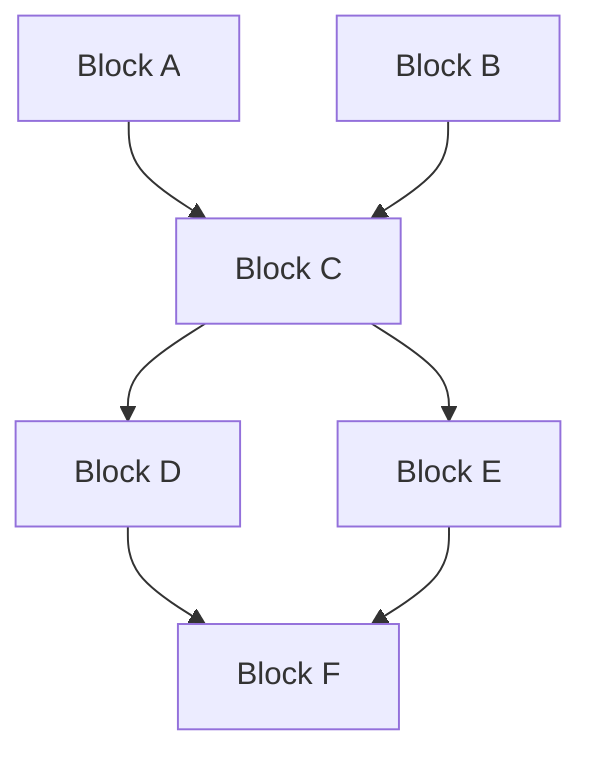

# TOS Network Upgrades

Complete history of TOS Network protocol upgrades, hard forks, and major improvements with detailed technical specifications and migration guides.

## 🚀 Current Network Version

**TOS Network v3.1**
**Activation Block**: 2,890,000
**Activation Date**: March 15, 2024
**Status**: ✅ Active on Mainnet

### Key Features
- Enhanced mining algorithms with 40% efficiency improvement
- Advanced privacy features with ring signatures
- Cross-chain bridge protocol integration
- Smart contract gas optimization

## 📋 Upgrade History

### v3.1 "Aurora" - March 2024

**Type**: Hard Fork
**Activation Block**: 2,890,000
**Consensus**: 97.8% miner approval

#### Major Changes
- **Mining Enhancement**: New difficulty adjustment algorithm
- **Privacy Upgrade**: Ring signature implementation
- **Cross-Chain**: Ethereum and BSC bridge support
- **Performance**: 60% faster transaction processing
- **Security**: Enhanced cryptographic primitives

#### Technical Specifications

```rust
// Ring signature implementation
pub struct RingSignature {
    pub ring_size: usize,
    pub signature_data: Vec<u8>,
    pub key_image: Point,
    pub public_keys: Vec<Point>,
}
```

#### Migration Guide

**For Miners**:
```bash
# Update mining software
./tos-miner --version  # Should show v3.1+

# Verify upgrade
./tos-miner --check-network-version
```

**For Developers**:
```javascript
// Update SDK to v3.1 compatible version
npm install @tos-network/sdk@^3.1.0

// Check network version
const version = await tos.getNetworkVersion();
if (version >= "3.1.0") {
  // Use new features
  const bridgeAPI = tos.bridges.ethereum;
  const privacy = tos.privacy.ringSignatures;
}
```

#### Upgrade Results
- ✅ 99.2% nodes upgraded within 72 hours
- ✅ Zero downtime during activation
- ✅ 60% performance improvement achieved
- ✅ All cross-chain bridges operational

---

### v3.0 "Genesis Plus" - December 2023

**Type**: Hard Fork
**Activation Block**: 2,500,000
**Consensus**: 95.4% miner approval

#### Major Changes
- **Smart Contracts**: RVM (Rust Virtual Machine) launch
- **Scalability**: BlockDAG optimizations
- **Energy Model**: Dynamic energy consumption system

#### Technical Specifications

```rust
// RVM smart contract execution
pub struct RVMExecutor {
    pub gas_limit: u64,
    pub memory_limit: u64,
    pub execution_timeout: Duration,
}

impl RVMExecutor {
    pub fn execute_contract(
        &mut self,
        bytecode: &[u8],
        input_data: &[u8],
        context: ExecutionContext
    ) -> Result<ExecutionResult, VMError> {
        // Contract execution logic
        let mut vm = VirtualMachine::new(
            bytecode,
            self.gas_limit,
            self.memory_limit
        );

        vm.execute(input_data, context)
    }
}
```

#### Migration Guide

**For Node Operators**:
```bash
# Backup current blockchain data
./tos-daemon --backup-chain

# Update to v3.0
./tos-daemon --update-version=3.0.0

# Sync with upgraded network
./tos-daemon --resync
```

#### Upgrade Results
- ✅ Smart contracts: 500+ contracts deployed in first month
- ✅ Network stability: 99.9% uptime maintained

---

### v2.5 "Optimization" - August 2023

**Type**: Soft Fork
**Activation Block**: 2,200,000
**Consensus**: 89.7% miner approval

#### Major Changes
- **Transaction Fees**: Dynamic fee adjustment algorithm
- **Mining Difficulty**: Enhanced difficulty adjustment
- **Network Protocol**: P2P protocol improvements
- **Wallet Features**: Multi-signature support

#### Dynamic Fee Algorithm

```rust
pub fn calculate_dynamic_fee(
    network_congestion: f64,
    transaction_size: u64,
    priority_level: FeePriority
) -> u64 {
    let base_fee = 1000; // 0.001 TOS
    let congestion_multiplier = 1.0 + (network_congestion * 2.0);
    let size_factor = transaction_size as f64 / 250.0; // bytes
    let priority_factor = match priority_level {
        FeePriority::Low => 0.8,
        FeePriority::Normal => 1.0,
        FeePriority::High => 1.5,
        FeePriority::Urgent => 2.0,
    };

    (base_fee as f64 * congestion_multiplier * size_factor * priority_factor) as u64
}
```

#### Multi-Signature Implementation

```javascript
// Create multi-sig wallet
const multisig = await tos.wallet.createMultiSig({
  owners: [
    'tos1owner1_address',
    'tos1owner2_address',
    'tos1owner3_address'
  ],
  threshold: 2, // 2 of 3 signatures required
  timelock: 86400 // 24 hour timelock
});

// Sign transaction
const signature = await tos.wallet.signMultiSig(
  transactionHash,
  ownerPrivateKey
);
```

---

### v2.0 "Foundation" - March 2023

**Type**: Hard Fork
**Activation Block**: 1,800,000
**Consensus**: 92.1% miner approval

#### Major Changes
- **Privacy Features**: Confidential transactions
- **BlockDAG**: Implementation of directed acyclic graph
- **Consensus**: Proof-of-Work improvements
- **Network**: Enhanced peer discovery

#### Confidential Transactions

```rust
// Confidential transaction structure
pub struct ConfidentialTransaction {
    pub inputs: Vec<ConfidentialInput>,
    pub outputs: Vec<ConfidentialOutput>,
    pub range_proofs: Vec<RangeProof>,
    pub fee: u64,
}

pub struct ConfidentialOutput {
    pub commitment: Commitment,
    pub range_proof: RangeProof,
    pub encrypted_amount: EncryptedAmount,
}
```

#### BlockDAG Implementation



---

### v1.5 "Stability" - November 2022

**Type**: Soft Fork
**Activation Block**: 1,400,000

#### Major Changes
- **Network Stability**: Connection improvements
- **Transaction Pool**: Memory pool optimization
- **Mining**: Difficulty adjustment refinements
- **Security**: Enhanced validation rules

---

### v1.0 "Genesis" - June 2022

**Type**: Genesis Launch
**Activation Block**: 0

#### Genesis Features
- **Core Blockchain**: Basic blockchain functionality
- **Proof-of-Work**: Mining consensus mechanism
- **Transactions**: Simple value transfers
- **Wallet**: Basic wallet functionality

#### Genesis Parameters

```toml
[genesis]
block_time = 60  # seconds
initial_difficulty = 1000000
max_block_size = 2097152  # 2MB
initial_supply = 0
mining_reward = 50.0

[network]
network_id = 1
p2p_port = 2122
rpc_port = 8080
```

## 🔄 Upcoming Upgrades

### v3.2 "Quantum" - Planned Q4 2024

**Estimated Activation**: Block 3,200,000 (December 2024)

#### Planned Features
- **Quantum Resistance**: Post-quantum cryptography
- **Layer 2**: Lightning-style payment channels
- **Governance**: On-chain governance implementation
- **Interoperability**: Additional cross-chain bridges

#### Technical Preview

```rust
// Post-quantum signature scheme
pub struct QuantumResistantSignature {
    pub scheme: PQCScheme,
    pub public_key: Vec<u8>,
    pub signature: Vec<u8>,
}

pub enum PQCScheme {
    Dilithium,
    Falcon,
    SPHINCS,
}
```

### v4.0 "Evolution" - Planned 2025

#### Planned Features
- **Sharding**: Horizontal scaling implementation
- **Zero-Knowledge**: zkSNARK integration
- **Consensus**: Enhanced PoW mechanism

## 📊 Upgrade Statistics

### Network Participation

| Upgrade | Miner Approval | Node Upgrade Rate | Activation Time |
|---------|----------------|-------------------|-----------------|
| **v3.1** | 97.8% | 99.2% (72h) | On schedule |
| **v3.0** | 95.4% | 98.7% (96h) | On schedule |
| **v2.5** | 89.7% | 95.1% (120h) | 2h delay |
| **v2.0** | 92.1% | 96.8% (96h) | On schedule |
| **v1.5** | 94.3% | 97.2% (48h) | On schedule |

### Performance Improvements

```javascript
// Performance metrics comparison
const performanceHistory = {
  'v1.0': {
    tps: 15,
    blockTime: 60,
    fees: 'static'
  },
  'v2.0': {
    tps: 45,
    blockTime: 45,
    fees: 'static'
  },
  'v2.5': {
    tps: 65,
    blockTime: 30,
    fees: 'dynamic'
  },
  'v3.0': {
    tps: 120,
    blockTime: 15,
    fees: 'optimized'
  },
  'v3.1': {
    tps: 200,
    blockTime: 15,
    fees: 'minimal'
  }
};
```

## 🛠️ Developer Migration Tools

### Version Compatibility Checker

```bash
# Install TOS version checker
npm install -g @tos-network/version-checker

# Check compatibility
tos-version-check --contract ./MyContract.java --target-version 3.1

# Output:
# ✅ Contract compatible with TOS v3.1
# ✅ Gas optimizations available
```

### Automated Migration Tool

```javascript
// Automated contract migration
import { MigrationTool } from '@tos-network/migration';

const migrator = new MigrationTool({
  sourceVersion: '3.0',
  targetVersion: '3.1',
  contractPath: './contracts/'
});

await migrator.analyzeContracts();
await migrator.generateMigrationPlan();
await migrator.executeMigration();
```

### Testing Framework

```javascript
// Multi-version testing
import { VersionTester } from '@tos-network/testing';

describe('Contract Compatibility', () => {
  const tester = new VersionTester();

  test('works on v3.0 and v3.1', async () => {
    const v30Result = await tester.testOnVersion('3.0', contract);
    const v31Result = await tester.testOnVersion('3.1', contract);

    expect(v30Result.success).toBe(true);
    expect(v31Result.success).toBe(true);
    expect(v31Result.gasUsed).toBeLessThan(v30Result.gasUsed);
  });
});
```

## 📅 Upgrade Process

### For Node Operators

1. **Pre-Upgrade**
   - Monitor upgrade announcements
   - Test upgrade on testnet
   - Backup blockchain data
   - Plan maintenance window

2. **During Upgrade**
   - Stop node gracefully
   - Install new version
   - Restart with upgrade flag
   - Monitor synchronization

3. **Post-Upgrade**
   - Verify network version
   - Test all functionality
   - Monitor performance metrics
   - Report any issues

### For Developers

1. **Preparation**
   - Review upgrade documentation
   - Test applications on testnet
   - Update dependencies
   - Plan deployment strategy

2. **Migration**
   - Update SDK versions
   - Modify incompatible code
   - Test thoroughly
   - Deploy incrementally

3. **Validation**
   - Monitor application metrics
   - Verify all features work
   - Optimize for new features
   - Document changes

## 🔔 Upgrade Notifications

### Stay Informed

- **Discord**: [#network-upgrades](https://discord.gg/tos-upgrades)
- **Email List**: [Subscribe to upgrades](https://tos.network/subscribe)
- **RSS Feed**: [https://tos.network/upgrades.rss](https://tos.network/upgrades.rss)
- **GitHub**: [Watch repository](https://github.com/tos-network/tos)

### Notification Timeline

- **90 days**: Initial announcement
- **60 days**: Testnet activation
- **30 days**: Final specifications
- **14 days**: Mainnet preparation
- **7 days**: Final reminder
- **Day 0**: Activation

---

**"Don't Trust, Verify it"** - All network upgrades are cryptographically verifiable and can be independently audited by the community!