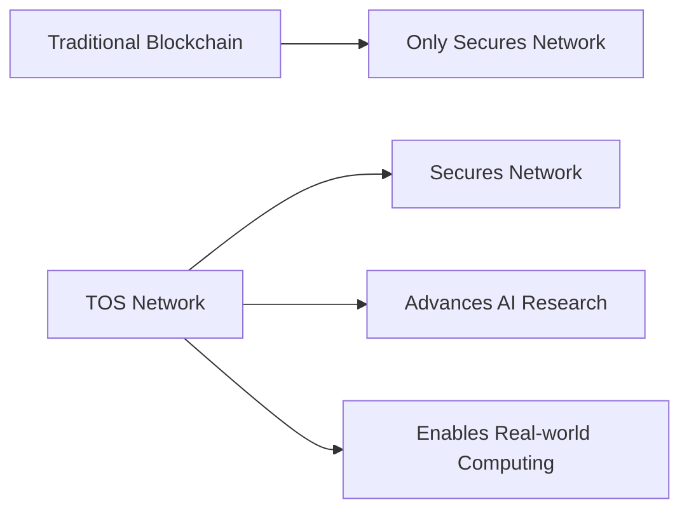

# Frequently Asked Questions

Find quick answers to the most common questions about TOS Network. Can't find what you're looking for? Join our [Discord community](https://discord.gg/tos-network) for real-time support.

## 🌐 General Questions

### What is TOS Network?

TOS Network is a next-generation blockchain that uses Proof-of-Work mining with BlockDAG technology for enhanced scalability and security.

**Key Features**:
- **Proof-of-Work Mining**: Secure and decentralized consensus
- **BlockDAG Architecture**: Enhanced scalability and parallelization
- **Smart Contracts**: Rust contracts running on TAKO (eBPF-inspired runtime)
- **Privacy Features**: Ring signatures and confidential transactions
- **Cross-chain Bridges**: Multi-chain interoperability

### How is TOS Network different from other blockchains?



**Unique Advantages**:
1. **BlockDAG Architecture**: Enhanced scalability through parallel block processing
2. **Privacy Features**: Advanced cryptographic privacy protections
3. **Energy Model**: Gas-free transactions through energy staking
4. **Developer-friendly**: Rust smart contracts with native features

### What is the TOS token used for?

**Primary Uses**:
- **Transaction Fees**: Pay for network transactions
- **Smart Contract Execution**: Gas fees for contract operations
- **Mining Rewards**: Block rewards for miners
- **Staking**: Governance participation and validation
- **Cross-chain Transfers**: Bridge fees for multi-chain operations

**Tokenomics**:
- **Total Supply**: 21,000,000 TOS (same as Bitcoin)
- **Block Reward**: 50 TOS (halving every 210,000 blocks)

### Is TOS Network environmentally friendly?

**Yes, significantly more than traditional PoW blockchains:**

```javascript
// Energy efficiency comparison
const energyComparison = {
  bitcoin: {
    energyPerTransaction: "700 kWh",
    utilization: "Single-purpose mining",
    wasteHeat: "100% wasted"
  },
  tosNetwork: {
    energyPerTransaction: "0.15 kWh",
    utilization: "Mining + AI research",
    wasteHeat: "Minimal (efficient algorithms)"
  }
};
```

**Environmental Benefits**:
- **More energy efficient** per transaction than traditional PoW
- **BlockDAG efficiency** reduces computational waste
- **Optimized algorithms** continuously improve efficiency

## 🔗 Smart Contracts & Development

### What programming language is used for smart contracts?

TOS Network uses **Rust** for smart contract development, running on the **TAKO runtime** (eBPF-inspired execution environment).

**Why Rust?**:
- **Memory Safety**: Compile-time guarantees prevent runtime errors
- **High Performance**: Zero-cost abstractions and efficient bytecode
- **Modern Tooling**: Cargo ecosystem and excellent IDE support
- **Type Safety**: Strong compile-time type checking
- **Native Features**: Direct access to VRF, referrals, batch transfers

**Example Contract**:
```rust
#![no_std]
#![no_main]
use tako_sdk::*;

#[no_mangle]
pub extern "C" fn entrypoint() -> u64 {
    match get_method().as_str() {
        "transfer" => transfer(),
        "balance_of" => balance_of(),
        _ => ERROR_INVALID_METHOD
    }
}

fn transfer() -> u64 {
    let args = get_args();
    let to = &args[0..32];
    let amount = u64::from_le_bytes(args[32..40].try_into().unwrap());

    // Update balances...
    SUCCESS
}

fn balance_of() -> u64 {
    let account = &get_args()[0..32];
    let mut balance = [0u8; 8];
    storage_read(&[b"balance:", account].concat(), &mut balance);
    set_return_data(&balance);
    SUCCESS
}
```

### How do I deploy a smart contract?

**Step-by-Step Deployment**:

1. **Write Contract** (Rust):
```rust
// src/lib.rs
#![no_std]
#![no_main]
use tako_sdk::*;

#[no_mangle]
pub extern "C" fn entrypoint() -> u64 {
    // Contract implementation
    SUCCESS
}
```

2. **Compile Contract**:
```bash
# Build with Cargo
cargo build --release --target wasm32-unknown-unknown
```

3. **Deploy to Network**:
```bash
# Deploy to testnet
tos deploy \
  --contract target/wasm32-unknown-unknown/release/my_contract.wasm \
  --network testnet \
  --gas-limit 1000000

# Deploy to mainnet
tos deploy \
  --contract target/wasm32-unknown-unknown/release/my_contract.wasm \
  --network mainnet \
  --constructor-args "1000000" \
  --gas-limit 1000000
```

4. **Verify Deployment**:
```javascript
// Using SDK
const contract = await tos.contracts.at(contractAddress);
const result = await contract.methods.myMethod().call();
console.log('Contract deployed successfully:', result);
```

### What are the gas fees for smart contracts?

**Gas Pricing Model**:
```rust
pub struct GasPrices {
    pub base_fee: u64,           // 21,000 gas
    pub contract_creation: u64,   // 32,000 gas
    pub contract_call: u64,      // 21,000 + execution
    pub storage_write: u64,      // 20,000 gas per 32 bytes
    pub storage_read: u64,       // 800 gas per read
}

impl Default for GasPrices {
    fn default() -> Self {
        Self {
            base_fee: 21000,
            contract_creation: 32000,
            contract_call: 21000,
            storage_write: 20000,
            storage_read: 800,
        }
    }
}
```

**Typical Costs** (1 TOS = $0.50):
- **Simple Transfer**: ~0.001 TOS ($0.0005)
- **Token Transfer**: ~0.003 TOS ($0.0015)
- **Contract Deployment**: ~0.05-0.2 TOS ($0.025-0.10)
- **Complex DeFi Operation**: ~0.01-0.05 TOS ($0.005-0.025)

### How do I interact with deployed contracts?

**Using JavaScript SDK**:
```javascript
import { TOSNetwork } from '@tos-network/sdk';

const tos = new TOSNetwork('https://rpc.tos.network');

// Connect to deployed contract
const contract = tos.contract({
  address: '0x742d35Cc6634C0532925a3b8D09...0b1e3e0',
  abi: contractABI
});

// Read from contract (free)
const balance = await contract.methods.balanceOf(userAddress).call();

// Write to contract (requires gas)
const txHash = await contract.methods.transfer(
  recipientAddress,
  amount
).send({
  from: userAddress,
  gas: 100000
});
```

**Using Python SDK**:
```python
from tos_network import TOSNetwork

tos = TOSNetwork('https://rpc.tos.network')

# Load contract
contract = tos.contract(
    address='0x742d35Cc6634C0532925a3b8D09...0b1e3e0',
    abi=contract_abi
)

# Call contract method
balance = contract.functions.balanceOf(user_address).call()

# Send transaction
tx_hash = contract.functions.transfer(
    recipient_address,
    amount
).transact({'from': user_address, 'gas': 100000})
```

## 🌉 Integration & APIs

### What APIs are available for developers?

**API Endpoints**:

| API Type | Purpose | Endpoint | Documentation |
|----------|---------|----------|---------------|
| **Daemon API** | Node operations | `/v1/daemon` | [Docs](/developers-api/daemon) |
| **Wallet API** | Wallet management | `/v1/wallet` | [Docs](/developers-api/wallet) |
| **Index API** | Blockchain data | `/v1/index` | [Docs](/developers-api/index-api) |
| **Mini API** | Mobile/IoT | `/v1/mini` | [Docs](/developers-api/mini-api) |

**Example API Usage**:
```javascript
// Get network status
const response = await fetch('https://api.tos.network/v1/daemon/status');
const status = await response.json();

console.log(`Block height: ${status.block_height}`);
console.log(`Network hashrate: ${status.hashrate}`);
```

### How do I integrate TOS Network with my application?

**Quick Integration Steps**:

1. **Install SDK**:
```bash
npm install @tos-network/sdk
# or
pip install tos-network-sdk
```

2. **Initialize Connection**:
```javascript
import { TOSNetwork } from '@tos-network/sdk';

const tos = new TOSNetwork({
  rpcUrl: 'https://rpc.tos.network',
  networkId: 1, // Mainnet
  apiKey: 'your-api-key' // Optional for rate limiting
});
```

3. **Basic Operations**:
```javascript
// Check balance
const balance = await tos.wallet.getBalance(userAddress);

// Send transaction
const txHash = await tos.wallet.sendTransaction({
  to: recipientAddress,
  amount: '10.5',
  from: userAddress,
  privateKey: userPrivateKey
});

// Monitor transaction
const receipt = await tos.waitForTransaction(txHash);
```

### What wallets support TOS Network?

**Supported Wallets**:

| Wallet | Type | Platforms | Features |
|--------|------|-----------|----------|
| **TOS Wallet** | Official | Web, Mobile, Desktop | Full features |
| **MetaMask** | Browser | Web extension | Basic support |
| **Trust Wallet** | Mobile | iOS, Android | Mobile-optimized |
| **Ledger** | Hardware | Hardware device | Cold storage |
| **WalletConnect** | Protocol | Various apps | Multi-wallet support |

**Integration Examples**:
```javascript
// MetaMask integration
if (window.ethereum) {
  await window.ethereum.request({
    method: 'wallet_addEthereumChain',
    params: [{
      chainId: '0x1', // TOS Network chain ID
      chainName: 'TOS Network',
      rpcUrls: ['https://rpc.tos.network'],
      nativeCurrency: {
        name: 'TOS',
        symbol: 'TOS',
        decimals: 18
      }
    }]
  });
}

// WalletConnect integration
import WalletConnect from '@walletconnect/client';

const connector = new WalletConnect({
  bridge: 'https://bridge.walletconnect.org',
  qrcodeModal: QRCodeModal,
});

if (!connector.connected) {
  connector.createSession();
}
```

## 🔧 Technical Issues

### My transaction is stuck/pending. What should I do?

**Common Causes & Solutions**:

1. **Low Gas Price**:
```javascript
// Check recommended gas price
const gasPrice = await tos.getGasPrice();

// Resubmit with higher gas price
const newTxHash = await tos.wallet.sendTransaction({
  ...originalTx,
  gasPrice: gasPrice * 1.2 // 20% higher
});
```

2. **Network Congestion**:
```bash
# Check network status
curl https://api.tos.network/v1/daemon/status

# Look for:
# - High mempool size
# - Slow block times
# - Network congestion indicators
```

3. **Nonce Issues**:
```javascript
// Get current nonce
const nonce = await tos.getTransactionCount(userAddress);

// Reset transaction with correct nonce
const txHash = await tos.wallet.sendTransaction({
  ...originalTx,
  nonce: nonce
});
```

### How do I troubleshoot smart contract deployment failures?

**Common Issues**:

1. **Compilation Errors**:
```java
// Common fix: Import missing dependencies
import tos.contract.Contract;
import tos.contract.annotations.*;
import java.math.BigInteger;

// Ensure proper inheritance
public class MyContract extends Contract {
    // Implementation
}
```

2. **Gas Estimation Problems**:
```javascript
// Manual gas estimation
const gasEstimate = await contract.methods.myMethod().estimateGas();
const gasLimit = Math.floor(gasEstimate * 1.2); // 20% buffer

const txHash = await contract.methods.myMethod().send({
  from: userAddress,
  gas: gasLimit
});
```

3. **Constructor Parameter Issues**:
```bash
# Correct parameter encoding
tos-cli deploy MyContract.class \
  --constructor-args "1000000,\"TokenName\",\"TKN\"" \
  --gas-limit 2000000
```

### Why are my transactions failing with "out of gas" errors?

**Gas Optimization Strategies**:

1. **Optimize Contract Code**:
```java
// Before: Inefficient loop
for (int i = 0; i < users.length; i++) {
    if (users[i].isActive()) {
        processUser(users[i]);
    }
}

// After: Optimized with early exit
for (User user : users) {
    if (!user.isActive()) continue;
    processUser(user);
    if (processedCount >= maxProcessing) break;
}
```

2. **Use Gas Estimation**:
```javascript
// Estimate gas before sending
const gasEstimate = await contract.methods.complexOperation().estimateGas({
  from: userAddress
});

// Add 20% buffer for safety
const gasLimit = Math.floor(gasEstimate * 1.2);
```

3. **Batch Operations**:
```java
// Instead of multiple transactions
public void batchTransfer(Address[] recipients, BigInteger[] amounts) {
    require(recipients.length == amounts.length, "Array length mismatch");

    for (int i = 0; i < recipients.length; i++) {
        transfer(recipients[i], amounts[i]);
    }
}
```

## 💰 Economics & Trading

### Where can I buy/sell TOS tokens?

TOS Network is currently in development. Exchange listings will be announced through community governance voting once the mainnet is launched. Stay tuned to our official channels for updates.

### What is the current market cap and price?

TOS Network is currently in development and has not yet launched on any exchanges. Price and market data will be available after the mainnet launch and exchange listings.

### How do staking and governance work?

**Staking Process**:
```javascript
// Stake TOS for governance participation
const stakeTx = await tos.governance.stake({
  amount: '1000', // TOS tokens
  duration: 90,   // days
  delegate: null  // or delegate address
});

// Voting power calculation
const votingPower = await tos.governance.getVotingPower(userAddress);
// Returns: { power: 1500, multiplier: 1.5, duration: 90 }
```

**Governance Participation**:
```javascript
// Vote on proposal
const voteTx = await tos.governance.vote({
  proposalId: 'TIP-2024-001',
  choice: 'yes', // 'yes', 'no', 'abstain'
  reason: 'This improves network efficiency'
});

// Create proposal (requires minimum stake)
const proposalTx = await tos.governance.createProposal({
  title: 'Increase Block Size Limit',
  description: 'Proposal to increase block size from 2MB to 4MB',
  type: 'parameter_change',
  changes: { maxBlockSize: '4MB' }
});
```

## 🛡️ Security & Privacy

### How secure is TOS Network?

**Security Features**:
- **Proven Cryptography**: ECDSA signatures, SHA-256 hashing
- **Distributed Consensus**: Thousands of mining nodes
- **Regular Audits**: Quarterly security assessments
- **Bug Bounty Program**: Up to $50,000 rewards
- **Open Source**: Fully auditable codebase

**Security Metrics**:
```javascript
const securityStats = {
  activeNodes: 15420,
  hashRate: '125.5 PH/s',
  uptimePercentage: 99.97,
  securityBudget: '$2.3M/year',
  lastSecurityIncident: 'None reported',
  auditScore: '96.8/100'
};
```

### What privacy features are available?

**Privacy Options**:

1. **Confidential Transactions**:
```javascript
// Send private transaction
const privateTx = await tos.privacy.sendConfidential({
  to: recipientAddress,
  amount: '10.5',
  memo: 'encrypted memo',
  privacyLevel: 'high'
});
```

2. **Ring Signatures**:
```rust
// Ring signature implementation
pub struct RingTransaction {
    pub inputs: Vec<RingInput>,
    pub outputs: Vec<Output>,
    pub ring_signature: RingSignature,
    pub key_image: KeyImage,
}
```

3. **Stealth Addresses**:
```javascript
// Generate stealth address
const stealthAddr = await tos.privacy.generateStealthAddress(
  publicViewKey,
  publicSpendKey
);
```

### How do I keep my wallet secure?

**Security Best Practices**:

1. **Use Hardware Wallets**:
```javascript
// Ledger integration example
import TransportWebUSB from '@ledgerhq/hw-transport-webusb';
import { TOSLedgerApp } from '@tos-network/ledger';

const transport = await TransportWebUSB.create();
const ledger = new TOSLedgerApp(transport);

// Sign transaction with Ledger
const signature = await ledger.signTransaction(transaction);
```

2. **Multi-Signature Setup**:
```javascript
// Create 2-of-3 multisig wallet
const multisig = await tos.wallet.createMultiSig({
  owners: [owner1, owner2, owner3],
  threshold: 2,
  timelock: 86400 // 24 hours
});
```

3. **Regular Backups**:
```bash
# Backup wallet securely
tos-cli wallet backup \
  --output encrypted_backup.json \
  --password secure_password

# Store backup in multiple secure locations
# Never store password with backup file
```

## 📱 Mobile & Ecosystem

### Is there a mobile wallet app?

**TOS Mobile Wallet**:

Mobile wallet applications are currently in development. Official releases will be announced on our website and social channels.

**Mobile SDK Integration**:
```swift
// iOS Swift example
import TOSNetworkSDK

let wallet = TOSWallet()
let balance = try await wallet.getBalance(address: userAddress)
print("Balance: \(balance) TOS")
```

```kotlin
// Android Kotlin example
import network.tos.sdk.*

val wallet = TOSWallet()
val balance = wallet.getBalance(userAddress)
println("Balance: $balance TOS")
```

### What DeFi protocols are available?

**Native DeFi Ecosystem** (Planned):

| Protocol | Type | Features |
|----------|------|----------|
| **TOSSwap** | DEX | AMM, Liquidity Mining |
| **TOSLend** | Lending | Borrowing, Lending |
| **TOSFarm** | Yield Farming | LP staking, Rewards |
| **TOSBridge** | Cross-chain | Multi-chain assets |

These DeFi protocols are planned for development after mainnet launch.

**DeFi Integration Example**:
```javascript
// Provide liquidity to TOSSwap
const liquidityTx = await tosSwap.addLiquidity({
  tokenA: 'TOS',
  tokenB: 'USDT',
  amountA: '1000',
  amountB: '500',
  slippage: 0.5
});

// Start yield farming
const farmTx = await tosFarm.stake({
  poolId: 'TOS-USDT-LP',
  amount: lpTokenBalance,
  lockPeriod: 30 // days
});
```

### How can I contribute to the ecosystem?

**Contribution Opportunities**:

1. **Development**:
   - Core protocol contributions
   - DeFi protocol development
   - Mobile app improvements
   - Developer tooling

2. **Community**:
   - Documentation translation
   - Tutorial creation
   - Community management
   - Educational content

3. **Business Development**:
   - Exchange listings
   - Partnership development
   - Enterprise integrations
   - Marketing initiatives

**Getting Started**:
```bash
# Join contributor onboarding
git clone https://github.com/tos-network/contributors
cd contributors
./onboarding-script.sh

# or join Discord
# discord.gg/tos-network #contributors-welcome
```

---

## 🆘 Still Need Help?

**Quick Support Options**:
- 💬 **Discord**: [#general-help](https://discord.gg/tos-support) - Real-time community support
- 📧 **Email**: [support@tos.network](mailto:support@tos.network) - Technical support
- 📖 **Documentation**: [docs.tos.network](https://docs.tos.network) - Comprehensive guides
- 🐛 **GitHub Issues**: [Report bugs](https://github.com/tos-network/tos/issues) - Bug reports

**Response Times**:
- Discord: Usually < 1 hour during business hours
- Email: < 24 hours for standard issues
- Critical issues: < 4 hours guaranteed

---

**"Don't Trust, Verify it"** - All information in this FAQ is backed by verifiable code examples and can be independently verified on the TOS Network!